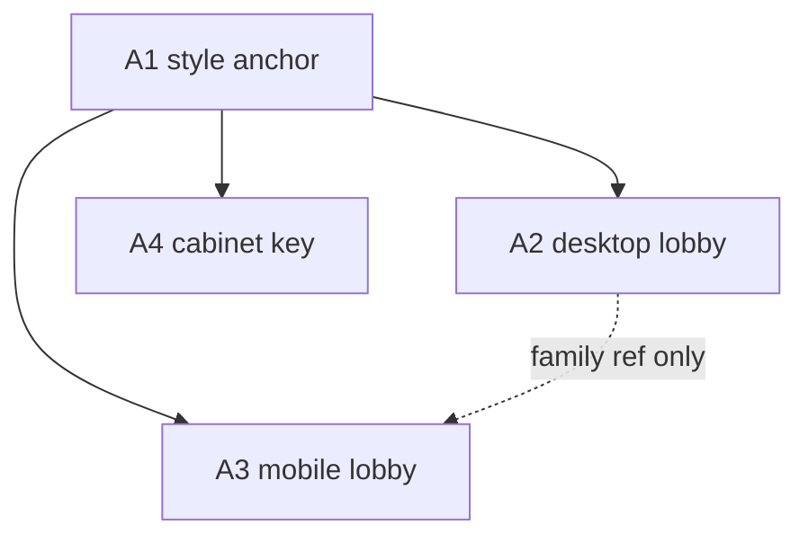

# Arcade asset manifest

Canonical inventory for **White Studio Games** lobby art produced with ChatGPT / GPT Image 2.

Visual rules: [`WHITE-STUDIO-SHARED-UI.md`](./WHITE-STUDIO-SHARED-UI.md)  
Prompts: [`../prompts/GPT-IMAGE-2-ARCADE-ASSETS.md`](../prompts/GPT-IMAGE-2-ARCADE-ASSETS.md)

**This phase:** originals received → QA → WebP → hub wired.  
**Next polish (optional):** regenerate at true 4K if sharper hero is needed; refine A4 soft fringe.

## QA log (2026-07-31 handoff)

| ID | Received size | Notes | Verdict |
|----|---------------|-------|---------|
| A1 | 1024×1024 (named 2048) | Clean silhouette, color mix OK, no text | Pass as style lock |
| A2 | 1024×576 (named 3840×2160) | Left copy space OK; soft BG cabinets in left third (acceptable) | Pass for MVP |
| A3 | 576×1024 (named 2160×3840) | Dedicated portrait recompose; top copy space OK | Pass |
| A4 | 768×1024 (named 1536×2048) | Flat green key; slight glow fringe → soft matte remove | Pass after process |

Site derivatives encoded via `scripts/process_arcade_assets.py`.

| Derivative | Size on disk | Budget |
|------------|--------------|--------|
| `lobby-desktop.webp` | ~52 KB (2560×1440 upscale) | ≤450 KB |
| `lobby-mobile.webp` | ~50 KB (1440×2560 upscale) | ≤320 KB |
| `cabinet-neon-runner.webp` | ~22 KB (+ PNG alpha fallback ~286 KB) | ≤220 KB webp |

**CSS focus:** desktop `object-position: 72% 48%`; mobile `50% 62%`.

## Asset inventory

| ID | Source filename | Site derivative (planned) | Size | Role | DOM target | Decorative? |
|----|-----------------|---------------------------|------|------|------------|-------------|
| A1 | `arcade-style-anchor-2048.png` | _(none — style lock only)_ | 2048×2048 | Style anchor: materials, light, cabinet silhouette, color mix | Not on site | n/a |
| A2 | `arcade-lobby-desktop-3840x2160.png` | `assets/images/arcade/lobby-desktop.webp` (+ optional `.jpg` fallback) | 3840×2160 (16:9) | PC / wide hero background | `.arcade-hero` / lobby stage | Yes (`alt=""`) |
| A3 | `arcade-lobby-mobile-2160x3840.png` | `assets/images/arcade/lobby-mobile.webp` (+ optional `.jpg` fallback) | 2160×3840 (9:16) | Mobile-only recompose (not a crop of A2) | same via `<picture>` | Yes (`alt=""`) |
| A4 | `arcade-cabinet-key-1536x2048.png` | `assets/images/arcade/cabinet-neon-runner.webp` (+ `.png` if alpha needed) | 1536×2048 (~3:4) | Single cabinet on chroma-key; post-process to alpha | `.arcade-cabinet` art / optional foreground | Prefer meaningful `alt` if contentful |

Suggested on-disk layout after handoff:

```text
assets/images/arcade/
  _raw/                         # originals from Image 2 (git-ignored if huge)
  lobby-desktop.webp
  lobby-mobile.webp
  cabinet-neon-runner.webp
```

## Focal points & safe zones

### A1 — Style anchor (2048×2048)

- Subject: one upright arcade cabinet, 3/4 view, centered
- Floor + soft environment only enough to read materials
- No copy safe zone required (not a hero)

### A2 — Desktop lobby (3840×2160)

| Region | X / Y of frame | Content |
|--------|----------------|---------|
| Copy / low-detail | X `0–44%` | Dim floor, soft wall, low contrast |
| Navbar clear | Y `0–14%` | No bright neon clusters or cabinet top |
| Primary focus | X `58–86%`, Y mid | Main cabinet + perspective |
| Crop margin | edges `~3%` | Avoid critical detail flush to edge |

**CSS focus hint (later):** `object-position: 72% 48%` (or measure after QA).

### A3 — Mobile lobby (2160×3840)

| Region | X / Y of frame | Content |
|--------|----------------|---------|
| Copy | Y `0–38%` | Quiet ceiling / empty air / soft glow only |
| Side crop | X `0–8%`, `92–100%` | No critical silhouette |
| Cabinet | Y `45–82%`, centered | Same family as A2/A4 |
| Footer clear | Y `88–100%` | No important geometry |

**CSS focus hint (later):** `object-position: 50% 62%`.

### A4 — Cabinet key (1536×2048)

- Flat `#00FF00` chroma-key fill (no gradient, no floor, no shadow on key)
- Hard silhouette; **no** soft outer glow (glow added in CSS after remove)
- Cabinet proportions per shared UI contract (~0.48 width:height, screen ~28% of height)
- Slight 3/4 turn, consistent with A1

## File budgets (site derivatives)

| Asset | Target max | Notes |
|-------|------------|-------|
| `lobby-desktop.webp` | ≤ **450 KB** | quality ~75–82; long edge may downscale to 2560 if needed |
| `lobby-mobile.webp` | ≤ **320 KB** | long edge may downscale to 1440–1920 |
| `cabinet-neon-runner.webp` | ≤ **220 KB** | after chroma remove; keep alpha if PNG fallback |

Raw Image 2 PNG may be multi‑MB; do not ship raw 4K PNG to Pages without compression.

## Generation order



1. Generate **A1** first; lock it — do not regenerate unless style is wrong.
2. Generate **A2** and **A4** with **A1** attached as reference.
3. Generate **A3** with **A1** (+ optionally **A2**) as reference; prompt must force **recompose**, not crop.

## Image 2 constraints (ops)

- Supported sizes include `3840x2160`, `2160x3840`, `2048x2048`, `1536x2048` when edges are multiples of 16 and within API limits.
- **`gpt-image-2` does not support transparent backgrounds.** A4 uses chroma-key; remove green in post.
- Prefer quality `high` for finals; one image per generation call.

## Handoff checklist (return → implement)

### You return

- [x] `arcade-style-anchor-2048.png`
- [x] `arcade-lobby-desktop-3840x2160.png`
- [x] `arcade-lobby-mobile-2160x3840.png`
- [x] `arcade-cabinet-key-1536x2048.png`
- [x] Brief note if any image was iterated (what failed / what fixed)

### Visual QA (before coding)

- [x] Color mix matches ~70 / 20 / 8 / ≤2 rule; no red-orange primary
- [x] A2 left 44% is copy-safe; top 14% navbar-safe
- [x] A3 top 38% copy-safe; cabinet in 45–82%; not a desktop crop
- [x] A4 pure green key, hard edge, no text/logo/UI
- [x] A2 / A3 / A4 read as same cabinet family as A1
- [x] No readable fake text / watermark / known IP

### Implementation phase (separate task — not this doc pass)

- [x] Chroma-key A4 → alpha PNG/WebP
- [x] Encode WebP under budgets; optional JPEG fallback
- [x] `<picture>` / CSS background for PC vs mobile
- [x] Wire into [`index.html`](../../index.html) + [`games-chrome.css`](../../assets/css/games-chrome.css)
- [ ] Verify 360 / 768 / 1440 / 4K and dark + light themes
- [x] Keep CSS neon/scanline as overlay; art stays under chrome z-index rules

## Status

| ID | Status |
|----|--------|
| A1–A4 specs | Defined |
| Image 2 prompts | See prompts doc |
| Raw files | In `assets/images/arcade/_raw/` |
| Site derivatives | Wired on hub (`index.html` + `games-chrome.css`) |
| Site wiring | Done (2026-07-31) |
